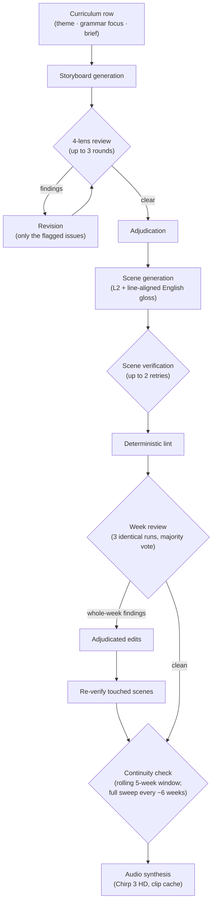

# Interleaver

**Listen:** [interleaver.org](https://interleaver.org/) plays every course in your browser.

This is a series of audio files, along with their transcripts, for language learning.
There is an **L1** language you already know and an **L2** language you want to learn.
The story follows a character, **Maya**, for the duration of a year. Maya is from
Mexico and is a software engineer. She relocates to a new city, and the year is about
her experiences there. The unit of the course is a **week**; the full design is 52
weeks, of which the **first 28 (levels A1 and A2) are complete**. The aim is to learn
a language by following Maya's journey through the year.

The overall spine of the story remains fixed; it is localized to each city. Six
courses are live: **Copenhagen** (Danish), **Kochi** (Malayalam), **Berlin**
(German), and **Mumbai** (Hindi, Marathi, and Sanskrit). The course never
explicitly mentions learning a language; Maya simply lives her life in it.

We follow a reasonable pacing and curriculum across the CEFR levels: **A1 for the
first fifteen weeks**, **A2 for the next thirteen** (through week 28, built), then
**B1 for thirteen** and **B2 for eleven** (planned), completing the 52-week year.

## Why audio-first

An objective of creating this course was to enable learning **hands-free and
screen-free**, for example while commuting or working out at the gym. The format is
similar to an audiobook or a podcast. Similar ideas exist elsewhere; ours differs in
that:

- it is completely open source and free to use: the code is under the MIT
  license, and the audio and text are under CC BY 4.0
  (see `LICENSE` and `LICENSE-CONTENT.md`);
- there are paired L1 and L2 transcripts, line-aligned;
- the audio comes in small per-week files (~8–10 minutes per language;
  interleaved versions roughly double);
- each week is part of one larger story, so no episode feels disconnected;
- spaced repetition support with flashcards.

## How the course is built

Let us take the example of the first instantiation, Maya in Copenhagen.

**Curriculum.** The course starts from a curriculum table, one row per week. Each row
contains the week's theme, its **grammar focus** (a grammar objective such as
possessives or WH-questions), and a **brief**: the topic of the week in about three
to four sentences. (Files: `curriculum_da.md`, `variants/kochi/curriculum_ml.md`.)

**Storyboard.** A large language model (we use `gemini-3.1-pro-preview`) converts each
curriculum row into a **storyboard**: multiple scenes, each with a title. The previous
week's storyboard is fed in as a format exemplar. The draft then goes through up to
three review-and-revise rounds. In each round, an API call reviews the storyboard
against four lenses (**continuity**, **narrative logic & coherence**, **realism &
privacy**, and a **naive-learner** lens), returning findings with a severity each.
The review is fed to another API call that makes edits *only* on the specific issues
identified. Finally, an **adjudication** pass by Claude Code goes through the last
round's remaining findings and decides, one by one, whether each should be applied.
(Code: `gen_storyboard.py`, `review_storyboard.py`.)

**Scenes.** Next, we generate a scene for each row of the storyboard. The inputs are
the story bible, the curriculum row, and all rows of the storyboard with the target
row marked. The API generates the Danish scene along with an English gloss, aiming
for a complete situation of **15–20 lines**; the Danish and English are line-aligned.
Each scene then passes **scene-level verification** (alignment, coherence,
naturalness, gloss fidelity). Failures are fed back to the scene generator in a
feedback loop that asks it to modify only the specific lines, for up to two retries.
(Code: `gen_week.py`.)

**Week review.** Once all scenes of a week are generated, we review the week as a
whole: continuity, coherence, repetition, contradictions, and so on. To avoid
stochasticity, we run this review identically **three times** and apply a **majority
vote at scene level**: only findings that at least two runs agree on enter the revise
loop for individual scenes. One lens checks for **filler text**; in an initial study
we found it highly precise, so it acts on a single vote. Some lenses are advisory and
are only logged in the report. Any change to a scene re-triggers the scene-level
verifier. (Code: `review_week.py`.)

Sometimes the week review identifies issues that apply to the whole week rather than
one scene. For example, the weather (say, rain) is mentioned in many scenes. In
that case the adjudicator decides which specific scenes are impacted, for example
in which scenes the weather mention should be curtailed.

**Continuity.** For every week, we run a **rolling continuity check** against the
previous five weeks, to catch contradictions and keep the story continuous. Every six
weeks or so, we run a continuity check across *all* weeks from week 1 to the current
week. (Code: `continuity_check.py`; deterministic checks live in `lint_week.py`.)

A human can **intervene at any stage** of generation, including the storyboard and
the scenes.

A sketch of the whole process:



**Audio.** Text-to-speech uses Google Cloud TTS with the **Chirp 3 HD "Sulafat"**
voice: a warm voice, kept as the one consistent narrator across languages. Sanskrit
is the exception as Google Cloud TTS doesn't support it. We synthesize its audio
with **ai4bharat/indic-parler-tts**, an open TTS model for Indic languages. Every
audio variant opens with a spoken "This week's grammar" introduction taken from
the curriculum.

## Scaling to many languages

To enable simple scaling to learning multiple languages, we translate the
Danish–English scripts into **44 further languages** and create the respective audio
files. With Danish and English themselves, the same story exists in **46 languages**,
which allows up to **46 × 45 = 2,070** ordered L2/L1 combinations of language
learning.

## Relocation: source-first generation

To enable **source-first generation** in different languages, we start from scratch:
a curriculum written in Malayalam, with a week sequence similar to the Danish one,
but based in Kochi. In a pilot comparison, we found that such source-first
generated content has a lower proportion of loan words and sounds less artificial
than translated content. This source-first path has since produced **Berlin**
(German) and **Mumbai** (Hindi, Marathi, Sanskrit). In case of Mumbai, we have
one shared storyboard, three source-first generated language tracks. Further
city/language pairs such as Paris/French and Rome/Italian are planned.

## Disclaimer & community

The course is primarily AI-generated. The L2 text has
not been verified to be natural. This is where we need help from the community:
if you are a native speaker and a line sounds off, please open a PR to fix the
language. Other feedback, issues, and PRs are also welcome.

## Spaced repetition & evaluating your learning

We also provide support for **spaced repetition** to
make learning faster. We create flashcards for vocabulary and translation, along with
audio for each card. The card types follow **Bloom's taxonomy** (remember,
understand, analyze, evaluate, create):

- **Remember**: vocabulary items;
- **Understand**: translation from L2 to L1;
- **Analyze**: cloze-style questions requiring the focused word form to be filled
  in correctly;
- **Evaluate**: translation from L1 to L2.

(Code: `gen_deck.py`.)

## Citation

A more detailed tech report is coming out soon. Meanwhile, for citation, you can use:

```bibtex
@software{puduppully2026Interleaver,
  author = {Puduppully, Ratish},
  title  = {Interleaver: story-driven audio language courses generated
            and verified by an LLM pipeline},
  year   = {2026},
  url    = {https://github.com/ratishsp/interleaver}
}
```

## Acknowledgements

We would like to acknowledge a grant of Google Gemini API credits.

